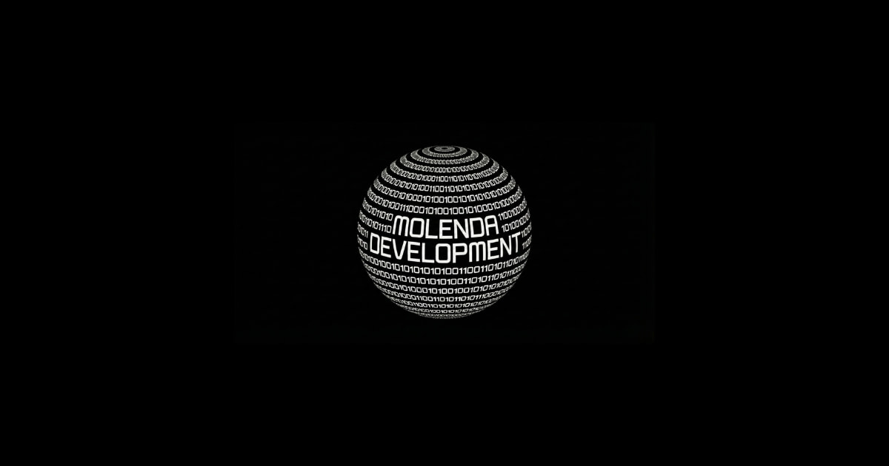

<p align="center">
  
</p>

<h1 align="center">Marcin Molenda — Developer Portfolio</h1>

<p align="center">
  <strong>Premium portfolio built with Next.js 16, Three.js, GSAP & Framer Motion</strong><br/>
  <em>A high-performance, scroll-driven experience showcasing real-world client projects</em>
</p>

<p align="center">
  <a href="https://molendadevelopment.pl"></a>
  
  
  
  
</p>
</p>


---

## 🇺🇸 English

### Overview

A custom-built developer portfolio designed as a **cinematic, scroll-driven experience** — not a template. Every animation, layout decision, and performance optimization is hand-crafted to deliver a premium user experience while maintaining **Lighthouse 100/100** scores.

### 🏗️ Architecture & Key Decisions

| Layer | Technology | Rationale |
|---|---|---|
| **Framework** | Next.js 16 (App Router) | Server Components, Turbopack, streaming SSR |
| **3D Engine** | Three.js + React Three Fiber | Interactive 3D model embedded in scroll layout |
| **Scroll Engine** | GSAP ScrollTrigger | Horizontal scroll pinning, snap-to-section, scrub animations |
| **Motion** | Framer Motion | Page transitions, micro-interactions, spring physics |
| **Styling** | Tailwind CSS v4 | Utility-first, dark mode, custom design tokens |
| **Analytics** | Umami (self-hosted) | Cookie-free, GDPR-compliant, no consent banners |
| **SEO** | JSON-LD, OpenGraph, Sitemap | Structured data for ProfessionalService schema |

### ✨ Technical Highlights

#### Performance-First Architecture
- **Dynamic imports** via `next/dynamic` — Three.js scene, Particles, and heavy modules loaded only when needed
- **`requestIdleCallback` (rIC)** pattern for deferring GSAP initialization to idle browser frames
- **Animated WebP** component with `IntersectionObserver` for lazy-loading and progressive reveal
- **Font optimization** — `Geist Mono` with `display: swap` to eliminate render-blocking

#### Scroll-Driven Layout
```
┌─────────────────────────────────────────────────────┐
│  Hero  │  Services  ──── Horizontal Scroll ────►    │
├─────────────────────────────────────────────────────┤
│                    About Section                     │
├─────────────────────────────────────────────────────┤
│  Portfolio │ Case 1 │ Case 2 │ ... │ Case 5  ────►  │
├─────────────────────────────────────────────────────┤
│                   Contact Section                    │
└─────────────────────────────────────────────────────┘
```
- Two independent horizontal scroll containers pinned via GSAP `ScrollTrigger`
- Desktop: `matchMedia('min-width: 1024px')` activates horizontal scrolling
- Mobile: Falls back to natural vertical scroll with full-width sections
- Sidebar lava progress bar synced via `MotionValue` (zero re-renders)

#### Interactive 3D Scene
- **UrwisModel** — GLB model loaded via `@react-three/drei`, embedded in the Case Studies section
- Interactive orbit with drag-to-rotate and parallax tilt on mouse move
- `Suspense` boundary with shimmer fallback for seamless loading

#### Custom UI Components
| Component | Purpose |
|---|---|
| `MagicBento` | Service cards with border-glow effect on hover |
| `MagneticWrapper` | Magnetic cursor attraction on CTA buttons |
| `AnimatedWebP` | Lazy-load animated images with IntersectionObserver + decode async |
| `Particles` | Canvas-based particle field with configurable color |

#### Live Demo Viewport
Built-in iframe preview system for showcasing deployed projects:
- Desktop/Mobile toggle with spring-animated viewport resize
- Keyboard-accessible (`Esc` to close)
- GTM event tracking on demo interactions

### 📂 Project Structure

```
moje-portfolio/
├── app/
│   ├── layout.tsx          # Root layout (fonts, metadata, JSON-LD, analytics)
│   ├── page.tsx            # Main portfolio page (scroll engine, sections)
│   ├── globals.css         # Design tokens & global styles
│   ├── not-found.tsx       # Custom 404 page
│   ├── robots.ts           # Robots.txt generation
│   ├── sitemap.ts          # Dynamic sitemap generation
│   └── polityka-prywatnosci/ # Privacy policy (GDPR)
├── components/
│   ├── Hero.tsx            # Hero section with orbital tech stack animation
│   ├── UrwisModel.tsx      # Three.js 3D model viewer
│   └── ui/
│       ├── AnimatedWebP.tsx # Lazy animated image component
│       ├── MagicBento.tsx   # Hover-glow card component
│       ├── MagneticButton.tsx
│       ├── MagneticWrapper.tsx
│       └── Particles.tsx    # Canvas particle system
├── public/
│   ├── urwis.glb           # 3D model asset
│   ├── *.webp              # Optimized project screenshots
│   └── sfx/                # UI sound effects
├── next.config.ts          # Turbopack, compression, package optimization
├── eslint.config.mjs       # ESLint flat config (Core Web Vitals + TypeScript)
└── tsconfig.json           # Strict TypeScript configuration
```

### 🚀 Getting Started

```bash
# Clone
git clone https://github.com/marcin2121/moje-portfolio.git
cd marcin

# Install
npm install

# Development (Turbopack)
npm run dev

# Production build
npm run build && npm start
```

### ⚡ Performance Optimizations

- Dynamic imports for Three.js, Particles, and GSAP (excluded from initial bundle)
- `requestIdleCallback` pattern for deferring GSAP/ScrollTrigger initialization to idle frames
- LCP element rendered without Framer Motion animation delay (zero render delay on desktop)
- Lazy-loaded `use-sound` / Howler.js — only imported on first user interaction, not at page load
- `IntersectionObserver`-based lazy loading for animated WebP images with decode async
- `display: swap` font loading strategy (eliminates render-blocking fonts)
- Turbopack-optimized tree-shaking for `lucide-react` and `framer-motion`
- Gzip/Brotli compression enabled via Next.js

---

## 🇵🇱 Polski

### Opis

Portfolio zaprojektowane jako **immersyjne doświadczenie scroll-driven** — nie szablon. Każda animacja, decyzja layoutowa i optymalizacja wydajności została stworzona ręcznie, aby dostarczyć premium UX przy zachowaniu wyników **Lighthouse 100/100**.

### 🏗️ Architektura i Technologie

| Warstwa | Technologia | Uzasadnienie |
|---|---|---|
| **Framework** | Next.js 16 (App Router) | Server Components, Turbopack, streaming SSR |
| **Silnik 3D** | Three.js + React Three Fiber | Interaktywny model 3D w layoutcie scrollowym |
| **Scroll** | GSAP ScrollTrigger | Horyzontalny scroll z pinowaniem i snap-to-section |
| **Animacje** | Framer Motion | Mikro-interakcje, animacje sprężynowe |
| **Stylizacja** | Tailwind CSS v4 | Utility-first, dark mode |
| **Analityka** | Umami (self-hosted) | Bez cookies, zgodne z GDPR |
| **SEO** | JSON-LD, OpenGraph, Sitemap | Dane strukturalne ProfessionalService |

### ✨ Kluczowe Rozwiązania Techniczne

- **Architektura Performance-First** — dynamiczne importy, `requestIdleCallback`, lazy-loading z `IntersectionObserver`
- **Scroll-Driven Layout** — dwa niezależne kontenery horyzontalnego scrolla z GSAP, responsywny fallback dla mobile
- **Interaktywna Scena 3D** — model GLB z `@react-three/drei`, drag-to-rotate, parallax na kursor
- **Wbudowany Viewport Demo** — system podglądu iframe z przełączaniem Desktop/Mobile i animacją sprężynową
- **Lava Progress Bar** — wskaźnik postępu synchronizowany z `MotionValue` (zero re-renderów React)

### 🚀 Instalacja

```bash
npm install
npm run dev
```

### 🤝 Kontakt

- **Web:** [molendadevelopment.pl](https://molendadevelopment.pl)
- **Email:** kontakt@molendadevelopment.pl

---

<p align="center">
  <sub>Built with precision by <strong>Marcin Molenda</strong> · © 2026</sub>
</p>
